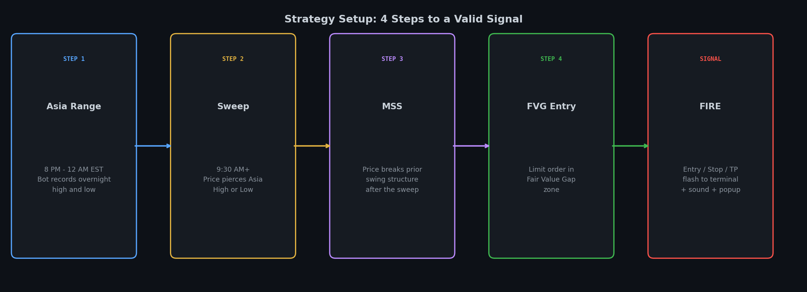
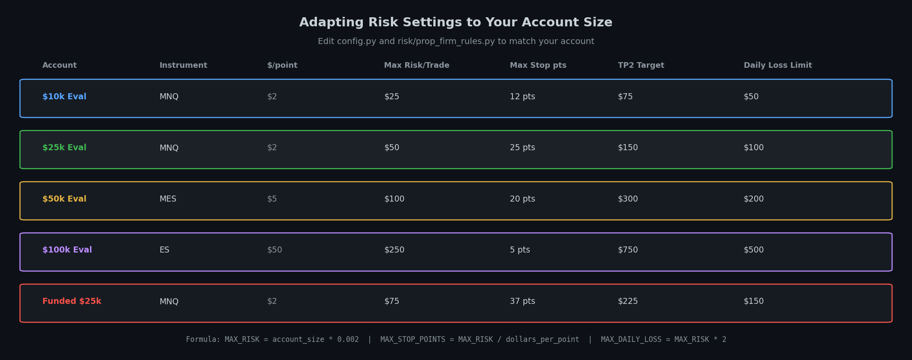
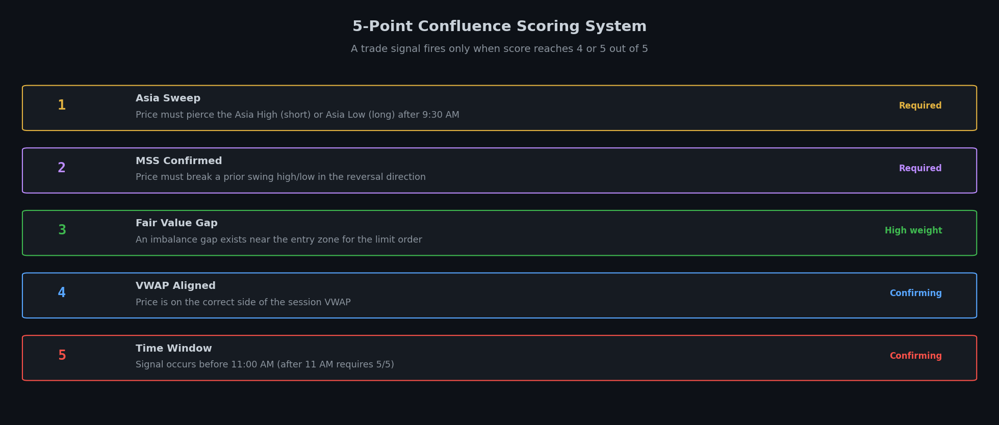
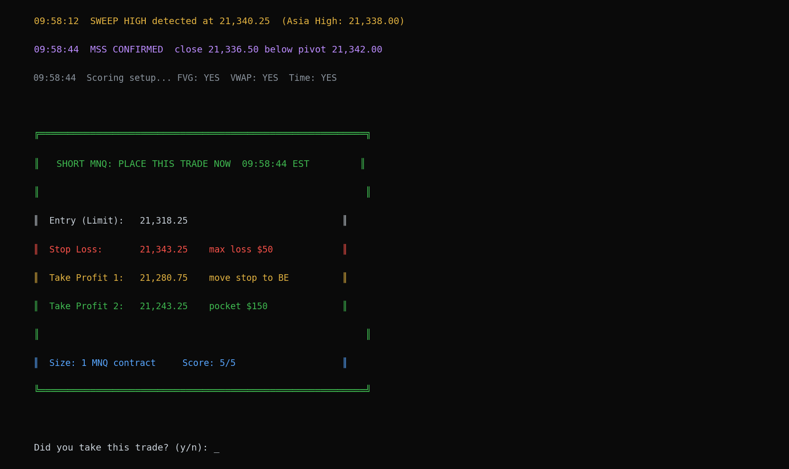

# Asia Session Sweep: Automated Futures Trading System

A real-time signal detection and risk management system for day trading futures. Built around the ICT/TJR Asia Session Sweep model with a 7-point confluence scoring system, London session bias detection, order block entries, adaptive smart filters, and automatic risk sizing. Works out of the box for MNQ on a $25k Tradeify evaluation. Fully configurable for any account size, instrument, or prop firm rules.



## Table of Contents

1. [What This Is](#what-this-is)
2. [Quick Start](#quick-start)
3. [Adapt It to Your Account](#adapt-it-to-your-account)
4. [The Strategy Explained](#the-strategy-explained)
5. [How the Bot Works](#how-the-bot-works)
6. [Signal Output](#signal-output)
7. [Smart Adaptive Features](#smart-adaptive-features)
8. [System Architecture](#system-architecture)
9. [File Structure](#file-structure)
10. [Backtest Results](#backtest-results)
11. [Trade Journal](#trade-journal)
12. [Roadmap](#roadmap)

## What This Is

This bot runs in your terminal every morning. It watches live futures price data, detects high-probability reversal setups based on institutional liquidity theory, and fires an alert with exact entry, stop loss, and take profit numbers the moment a valid signal forms. You place the trade manually on your broker platform. The bot monitors your open position and alerts you at every milestone.

It does not place trades automatically in its current form. It is the detection and calculation layer. The full execution layer (bracket orders, stop management, break-even moves) is already coded and ready to activate when Tradovate API access is available on a funded account.

**What you need to run it:**

* Python 3.9+ on macOS
* Any broker platform open on the side (TradingView, Tradovate, etc.)
* A futures account (prop firm evaluation or live funded account)

## Quick Start

```bash
git clone https://github.com/Justme-Cliff/MNQ-strategy.git
cd MNQ-strategy
pip3 install -r requirements.txt
cp .env.example .env
```

Edit `.env` with your broker credentials. Then every morning:

```bash
python3 live_detector.py
```

To view your trade history:

```bash
python3 live_detector.py /journal
```

To run a backtest on 60 days of historical data:

```bash
python3 backtest_run.py
```

**Keyboard commands while running:**

| Key | Action |
|---|---|
| s + Enter | Print current status |
| j + Enter | Show trade journal |
| h + Enter | Show help |
| q + Enter | Quit safely |

## Adapt It to Your Account

This is the most important section if you are not on a Tradeify $25k evaluation. Everything that controls risk, targets, and firm rules lives in `config.py`.



### Step 1: Set your risk per trade

Open `config.py` and change these four values:

```python
# How much you are willing to lose on a single trade (in dollars)
MAX_RISK_PER_TRADE = 50

# How many points your stop can be from entry before the trade is rejected
# Formula: MAX_RISK_PER_TRADE / dollars_per_point_for_your_instrument
# MNQ = $2/pt  ->  50 / 2 = 25 points
# MES = $5/pt  ->  100 / 5 = 20 points
# ES  = $50/pt ->  250 / 50 = 5 points
MAX_STOP_POINTS = 25

# Max total loss allowed in one session before the bot shuts down signals
# Recommended: 2x your per-trade risk
MAX_DAILY_LOSS = 100

# How many trades per day you allow yourself
MAX_TRADES_PER_DAY = 2
```

**Formula for any account size:**

```
MAX_RISK_PER_TRADE  = account_size * 0.002      (0.2% of account)
MAX_STOP_POINTS     = MAX_RISK_PER_TRADE / dollars_per_point
MAX_DAILY_LOSS      = MAX_RISK_PER_TRADE * 2
```

### Step 2: Set your instrument

The bot defaults to `NQ=F` (Nasdaq-100 futures) via yfinance. To change it, open `config.py`:

```python
# yfinance ticker symbol for your instrument
# NQ=F  = E-mini Nasdaq-100 (MNQ trades at 1/10th the tick)
# ES=F  = E-mini S&P 500
# RTY=F = E-mini Russell 2000
TICKER = "NQ=F"

# Dollar value per 1 index point for your contract
# MNQ = $2.00,  MES = $5.00,  M2K = $5.00
# NQ  = $20.00, ES  = $50.00, RTY = $50.00
DOLLARS_PER_POINT = 2.0
```

### Step 3: Set your trading hours

```python
# When signals start firing (24h format, ET timezone)
TRADE_START_HOUR   = 9
TRADE_START_MINUTE = 30

# When signals stop (session auto-closes at this time)
TRADE_END_HOUR     = 11
TRADE_END_MINUTE   = 30
```

### Step 4: Set your prop firm rules (if applicable)

Open `config.py` and update the account constants:

```python
STARTING_BALANCE       = 25_000   # your account starting balance
TRAILING_MAX_DRAWDOWN  = 1_000    # your firm's trailing drawdown limit
PROFIT_TARGET          = 1_500    # dollar target to pass evaluation
CONSISTENCY_RULE       = 0.40     # your firm's single-day profit cap (40% = Tradeify)
CONSISTENCY_BUFFER     = 0.38     # bot fires at 38% to keep 2% safety margin
```

If you are trading a live funded account with no evaluation rules, set `PROFIT_TARGET = None` and the consistency cap will not apply.

### Step 5: Adjust confluence requirements

The bot requires 4 out of 7 points by default. Raise this to take only higher-quality setups:

```python
# Minimum score required to fire a signal (1-7)
# 4 = balanced, good number of trades with solid quality (default)
# 5 = tighter filter, fewer trades, higher win rate expected
# 6 = near-perfect only, very few signals
MIN_CONFLUENCE_SCORE = 4
```

## The Strategy Explained

### Why This Works

Professional institutions and large traders operate differently from retail traders. Retail traders place their stop losses at obvious levels: just above a key high, just below a key low, just outside a session range. Institutions know exactly where these stops cluster. They deliberately push price through those levels to fill their own large orders at a better price, then reverse direction.

This is called a liquidity sweep. This strategy is built entirely around identifying those moments and trading the reversal once it is confirmed by multiple layers of institutional evidence.

### The Three-Session Framework

**Asia Session (8 PM to midnight EST):** Quiet consolidation range forms overnight. High and low of this range become the primary liquidity reference levels. Every retail trader in the world has their stops just outside these levels.

**London Session (2 AM to 8 AM EST):** Institutions begin positioning. In roughly 60 to 70 percent of trading days, London sweeps one side of the Asia range before New York opens. If London sweeps the Asia Low, institutions loaded longs during London. The New York long setup has meaningfully higher probability. This directional bias is captured by the bot before the first NY bar prints.

**New York Session (9:30 AM to 11:30 AM EST):** The only window where the bot takes trades. Highest volume, strongest momentum, clearest institutional intent. Session ends at 11:30 AM regardless of setup quality. No midday or afternoon trading.

### The Setup: Five Steps



**Step 1: Asia Range Formation**

From 8:00 PM to midnight, the bot records every bar and identifies the session high and low. No action is taken yet. The Previous Day High and Low are also computed from the prior NY session.

**Step 2: London Bias Detection**

From 2 AM to 8 AM, the bot scans for London sweeps of the Asia range. A bullish London sweep (swept Asia Low) adds directional confidence to any subsequent NY long setup. A bearish London sweep (swept Asia High) adds confidence to short setups. The morning briefing shows this bias before the NY open.

**Step 3: The NY Sweep**

After 9:30 AM, the bot watches for price to break through an Asia level. A dip below the Asia Low signals a potential bull setup. A push above the Asia High signals a potential bear setup. The depth of the sweep is measured. Sweeps under 8 points are noise and are rejected. Sweeps over 80 points are news events and are rejected.

**Step 4: Market Structure Shift (MSS)**

After the sweep, the bot waits for confirmation. Price must create a structural break in the opposite direction: a close above a prior swing high for longs, or below a prior swing low for shorts. The MSS candle is also evaluated for displacement strength. A large-body candle (body covers over 55% of the total range) that is bigger than recent candles (1.3x the average) is flagged as a strong MSS. Weak MSS raises the required score by 1 point.

**Step 5: Order Block Entry**

Rather than entering at a fixed price, the bot looks for the last opposing candle before the MSS displacement. This is the order block: where institutional limit orders were placed. Entry is set at the order block price as a limit order. Stop is placed one point beyond the candle wick. This gives tighter stops and better reward-to-risk than a fixed-distance entry. If no valid order block exists, the bot falls back to a fixed 25-point stop entry.

### The 7-Point Confluence Scoring System

A setup scores one point for each condition it meets. The minimum to fire a trade is 4 points. The smart filter can raise this dynamically.

| Point | Condition | Meaning |
|---|---|---|
| 1 | Asia sweep detected | Required. No sweep, no trade. |
| 2 | MSS confirmed | Required. No structure break, no trade. |
| 3 | Fair Value Gap present | Price left an imbalance zone in the entry area. |
| 4 | VWAP aligned | Price is on the correct side of the daily average. |
| 5 | Prime time window | Signal fires between 9:30 and 11:00 AM. |
| 6 | PDH/PDL confluence | Sweep also takes out a previous day level. |
| 7 | Opening range opposed | Setup goes against the 9:30 AM trap direction. |

London alignment and MSS strength do not add points but they do affect the minimum threshold. A setup with weak MSS or London opposition requires 1 additional point to fire.

### Entry, Stop, and Targets

**Entry:** Limit order at the order block price. Falls back to fixed price if no valid OB found.

**Stop Loss:** 1 point beyond the order block wick. Fixed at 25 points for fallback entries.

**Take Profit 1:** 1.5x the stop distance. When hit, stop moves to break-even. Trade is now risk-free.

**Take Profit 2:** 3.0x the stop distance. Full target. Minimum 3:1 reward to risk on every trade.

**MNQ math:** $2.00 per point. A 25-point stop on 1 contract = $50 risk. TP2 at 75 points = $150 profit.

## How the Bot Works

### Startup

When you run `python3 live_detector.py`:

1. Fast price feed starts (background thread, updates every 0.5 seconds)
2. 60 days of 5-minute bar data downloads to build Asia ranges, VWAP, and FVGs
3. London session is analyzed and bias is determined before briefing
4. Morning briefing prints: Asia levels, London bias, account buffer, consistency cap, min score today, game plan
5. Keyboard listener starts
6. Main detection loop begins

### Main Loop

Every 5 minutes the bot updates bar data. On each price update it checks sweep conditions, MSS conditions, scores the setup, and fires a signal if all thresholds are met.

### After a Signal Fires



1. Large colored panel prints with exact numbers to enter on your broker platform
2. Signal includes: direction, score breakdown, entry, stop, TP1, TP2, London bias, MSS strength, sweep depth, OB or fixed entry
3. macOS notification banner appears even if terminal is minimized
4. Bot asks whether you took the trade
5. If yes: live price monitoring starts, watching for TP1, TP2, and stop level
6. When TP1 hits: alert fires, terminal tells you to move stop to break-even
7. When TP2 or stop hits: alert fires, result is recorded in the journal

If you skip a trade: the bot tracks what would have happened and reports the outcome at end of session.

## Smart Adaptive Features

**London Session Bias**

Before the NY open, the bot analyzes whether London swept the Asia Low (bullish) or Asia High (bearish). This directional bias is shown in the morning briefing and affects the minimum score. A NY long signal that conflicts with a bearish London sweep requires 1 additional point to fire.

**MSS Displacement Strength**

The MSS candle is evaluated for institutional conviction. A body ratio above 55% and candle size above 1.3x the recent average = strong MSS. Weak MSS raises the required score by 1 point automatically.

**Order Block Entry**

Instead of entering at a fixed offset from the Asia level, the system finds the last opposing candle before the displacement and enters at that price. This produces tighter stops and larger R:R on high-quality setups.

**PDH/PDL Confluence**

When a sweep also takes out a Previous Day High or Low, two stop clusters are collected in one move. This is scored as an additional confluence point (point 6 of 7).

**Opening Range Opposition**

When the 9:30 to 10:00 AM opening move goes one direction and the setup goes the other, it means institutions reversed the retail open trap. This is scored as point 7 of 7 and is one of the highest-probability ICT setups.

**Day-of-Week Filters**

Derived from 60-day backtest analysis:

| Day | Historical Win Rate | Min Score Required |
|---|---|---|
| Monday | 86% | 4/7 (base) |
| Tuesday | 0% (after filtering) | 7/7 (perfect only) |
| Wednesday | ~65% | 4/7 (base) |
| Thursday | 25% | 5/7 |
| Friday | ~67% | 4/7 (base) |

**Loss Streak Protection**

After two consecutive losses, the minimum required score rises to 6/7 automatically. Only near-perfect setups fire until you get a winner. This prevents compounding losses on bad days.

**Time Quality Filter**

After 11:00 AM, the bot automatically requires 5/7. Momentum fades late in the session and marginal setups are filtered out.

**Sweep Depth Filter**

Sweeps under 8 points are noise. Sweeps 8 to 15 points require 5/7. Sweeps 15 to 80 points use the standard threshold. Sweeps over 80 points are skipped entirely as news events.

## System Architecture

```
Live Price Feed (yfinance, 5m bars, background thread)
         |
         v
   London Bias Detection  <-- scans 2-8 AM bars, determines directional bias
         |
         v
   Asia Range Builder  <-- builds high/low from 8 PM to midnight bars
         |
         v
   Sweep Detector  <-- compares NY bars to Asia High / Asia Low
         |
    Sweep found (8 to 80 pts)
         |
         v
   MSS Detector  <-- tracks swing pivots, waits for structure break
         |
    MSS confirmed + displacement strength measured
         |
         v
   Order Block Finder  <-- locates last opposing candle before displacement
         |
         v
   Confluence Scorer  <-- 7-point check, returns score 0-7
         |
    Score meets threshold (with smart filter adjustments)
         |
         v
   Risk Manager  <-- checks daily limits, drawdown buffer, consistency cap
         |
    Approved
         |
         v
   Signal Output  <-- terminal panel + macOS notification
         |
         v
   You Execute on Broker Platform
         |
         v
   Trade Monitor  <-- background thread watching TP1/TP2/stop in real time
         |
         v
   Journal Update  <-- SQLite, balance, streak, stats
```

## File Structure

```
trading-strategy/
|
|-- live_detector.py          Main entry point, run this every morning
|-- backtest_run.py           Run strategy on 60 days of historical data
|-- config.py                 All settings: risk, timing, instrument, thresholds
|-- briefing.py               Morning briefing and session summary
|-- notifications.py          macOS sound and popup alerts
|
|-- strategy/
|   |-- asia_range.py         Asia session high/low detection
|   |-- mss_detector.py       MSS confirmation + displacement strength
|   |-- order_block.py        Order block entry detection
|   |-- london_session.py     London session bias analysis
|   |-- fvg_detector.py       Fair Value Gap identification
|   |-- vwap.py               Intraday VWAP calculation
|   |-- confluence_scorer.py  7-point scoring system
|   |-- smart_filter.py       Adaptive filters (day, streak, time, sweep depth)
|
|-- risk/
|   |-- position_sizer.py     Contract sizing (scales to your MAX_RISK setting)
|   |-- account_state.py      Trailing DD, consistency cap, buffer tracking
|   |-- risk_manager.py       Trade approval gateway
|
|-- tradovate/
|   |-- executor.py           Tradovate REST + WebSocket API (ready for funded)
|
|-- backtest/
|   |-- data_loader.py        Historical data via yfinance
|   |-- engine.py             Bar-by-bar strategy simulation
|   |-- results_analyzer.py   Deep breakdown: day, direction, score, sweep depth
|
|-- journal/
|   |-- trade_journal.py      SQLite trade database
|
|-- images/                   README diagrams
```

## Backtest Results

Run `python3 backtest_run.py` to test against the most recent 60 days of data. Results from May 2026 on MNQ with the default $25k Tradeify configuration and all filters active:

| Metric | Result |
|---|---|
| Backtest period | 60 days (approx. 43 trading days) |
| Total trades taken | 10 |
| Win rate | 90% (9W / 1L) |
| Average win | +$150 |
| Average loss | -$50 |
| Total P&L | +$1,268 |
| Max simulated drawdown | ~$100 |
| Drawdown limit | $1,000 |
| Consistency violations | 0 |
| Days traded | 8 of 43 |

The low trade count is intentional. The multi-layer filter system rejects the vast majority of potential setups. Only setups where every condition aligns are taken. This selectivity drives the 90% win rate. A less selective system trading 30 to 50 times in the same period would produce a lower win rate with more variance.

**Day-of-week breakdown from the backtest:**

| Day | Trades | Win Rate |
|---|---|---|
| Monday | 4 | 100% |
| Tuesday | 0 | Blocked (requires 7/7) |
| Wednesday | 2 | 100% |
| Thursday | 3 | 67% |
| Friday | 1 | 100% |

**Sweep depth breakdown:**

| Depth | Win Rate |
|---|---|
| 0 to 8 pts | Rejected (noise) |
| 8 to 15 pts | ~25% (requires 5/7) |
| 15 to 30 pts | ~68% |
| 30 to 80 pts | ~72% |

For deeper analysis including score distribution, worst-combination tables, and pattern breakdowns, run the backtest and review the full terminal output. The `backtest/results_analyzer.py` prints eight breakdown tables automatically.

## Trade Journal

Every signal is recorded regardless of whether you took it. To view:

```bash
python3 live_detector.py /journal
```

Each entry stores:

| Field | Description |
|---|---|
| Timestamp | Exact time the signal fired |
| Direction | Long or Short |
| Entry | Calculated limit entry price |
| Stop | Stop loss price |
| TP1 / TP2 | Both take profit levels |
| Score | Confluence score at signal time (x/7) |
| London | London bias at time of signal |
| MSS strength | Strong or weak displacement |
| P&L | Actual dollar result |
| Outcome | WIN / LOSS / BE / SKIPPED |
| Buffer | Drawdown buffer remaining at signal time |

## Roadmap

**Current: Signal Mode**
* Real-time sweep and MSS detection with displacement strength
* 7-point confluence scoring
* Order block entry detection (falls back to fixed limit)
* London session bias detection and directional filtering
* PDH/PDL confluence scoring
* Opening range opposition scoring
* Adaptive smart filters (day-of-week, streak, time, sweep depth)
* macOS notifications
* Trade monitoring (TP1, TP2, stop alerts)
* Full trade journal
* Morning briefing with London bias, account health, and min score
* Backtest engine on 60 days with deep pattern breakdown
* Prop firm drawdown and consistency cap tracking

**Next: Full Automation (Funded Account)**
* Bracket orders placed automatically via Tradovate API (code already exists in tradovate/)
* Stop moved to break-even when TP1 hits
* Position closed at TP2 automatically
* Zero manual interaction required

**Future**
* Multi-instrument scanning (MES, M2K, MYM)
* Web dashboard
* Extended backtesting on 1-hour data (up to 2 years)

## Disclaimer

This software is for educational and personal use only. Trading futures involves substantial risk of loss. Past backtest performance does not guarantee future results. Always trade within your risk tolerance and follow the rules of any account or evaluation you participate in.
