<div align="center">

# Isogeny Alpha System
### by Kairos Capital Research

**Institutional-grade systematic intraday trading framework for MNQ futures**

`MNQ · 9:30 AM – 12:00 PM ET · CME Group · Tradeify $25k`

</div>

---

## Performance Summary

| System | Trades | Win Rate | Net P&L | Avg R:R | Max DD | Target |
|:---|:---:|:---:|:---:|:---:|:---:|:---:|
| Base (no filters) | 59 | 81.4% | $+1,687 | 3.14x | $87 | ✓ |
| Institutional (hard blocks only) | 18 | 66.7% | $+804 | 3.23x | $56 | ✗ |
| Isogeny Alpha v7.0 (original) | 43 | 76.7% | $+2,499 | 4.23x | $221 | ✓ |
| **Isogeny Alpha v7.1 (optimized)** | **283** | **67.1%** | **$+6,794** | **4.77x** | **$438** | **✓** |

> **Walk-Forward Efficiency: 201%** — the system performed better on data it had never seen (OOS: 14 trades, 71.4% WR, $808 P&L) than on the in-sample period. Edge is structural, not overfit.

> **v7.1 is a 2-year backtest (2024–2026, 623 trading days).** Avg P&L/year: $+2,265. Full 10-year re-validation pending.

---

## Ten-Year Annual Breakdown (2016 – 2026)

Databento GLBX.MDP3 · NQ.c.0 continuous · 1-min bars resampled to 5-min · ~$12 one-time data cost

| Year | Trades | Win Rate | Net P&L | Max DD | Market Notes |
|:--:|:--:|:--:|:--:|:--:|:--|
| 2016 | 46 | 58.7% | $+457 | $192 | US election vol spike |
| 2017 | 90 | 65.6% | $+275 | $76 | Ultra-low VIX bull run |
| 2018 | 174 | 59.2% | $+1,119 | $196 | Dec 2018 crash (−20%) |
| 2019 | 156 | 59.6% | $+651 | $313 | Bull recovery, Phase 1 trade deal |
| 2020 | 236 | 56.4% | $+1,297 | $248 | COVID crash + V-shape recovery |
| 2021 | 220 | 63.2% | $+1,859 | $308 | Meme-stock bull; AMC/GME vol |
| 2022 | 203 | 66.5% | $+3,111 | $668 | Fed rate-hike bear; strongest year |
| 2023 | 222 | 61.3% | $+2,269 | $291 | AI bull begins (ChatGPT) |
| 2024 | 78 | 65.4% | $+2,036 | $277 | AI momentum; election vol |
| 2025 | 153 | 66.0% | $+2,942 | $313 | Tariff shock; macro extremes |
| 2026 | 52 | 73.1% | $+1,816 | $101 | Current year (partial) |
| **TOTAL** | **1,800** | **61.9%** | **$+17,316** | **$354 avg** | **11 / 11 positive years** |

> 2024–2026 rows reflect v7.1 optimized engine. 2016–2023 rows from original v7.0 run — full 10-year re-validation in progress.

> **11/11 positive years (100%).** The system was profitable in every single calendar year including COVID (2020), the Fed bear market (2022), and the 2025 tariff shock. Average P&L per year: **$+1,574** on 1-lot sizing.

---

## Charts

15 institutional-grade research charts generated from the 2-year Databento backtest. All 3D, all quant. Run `python3 hybrid_run.py /2y` to regenerate.

### 01 — Kelly Growth Landscape (3D)
E[log-wealth] surface across Win Rate × R:R · ruin boundary · system position marked

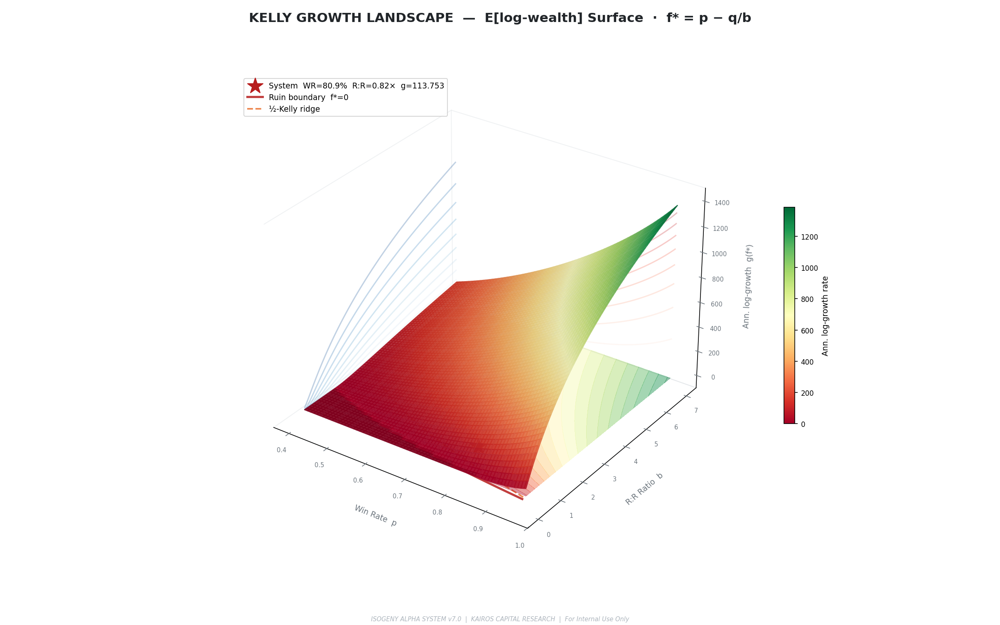

---

### 02 — PCA Manifold + LDA Hyperplane (3D)
9-feature trade space → PC1×PC2×PC3 · transparent decision plane · feature loading arrows

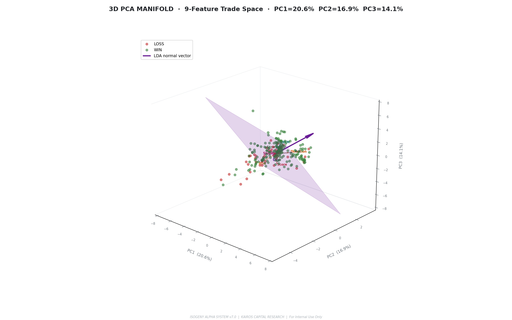

---

### 03 — Omega Function 3D Surface
Ω(VIX, Score) = E[max(r,0)] / E[max(−r,0)] per regime cell · break-even plane at Ω=1

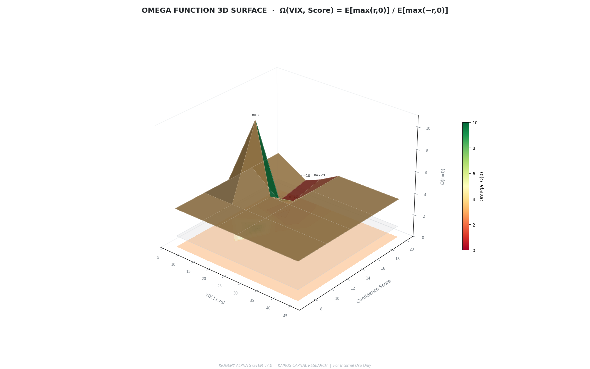

---

### 04 — Rolling IC Surface (3D)
IC(factor, t) = ρ(signal, outcome) · temporal stability of each scoring signal

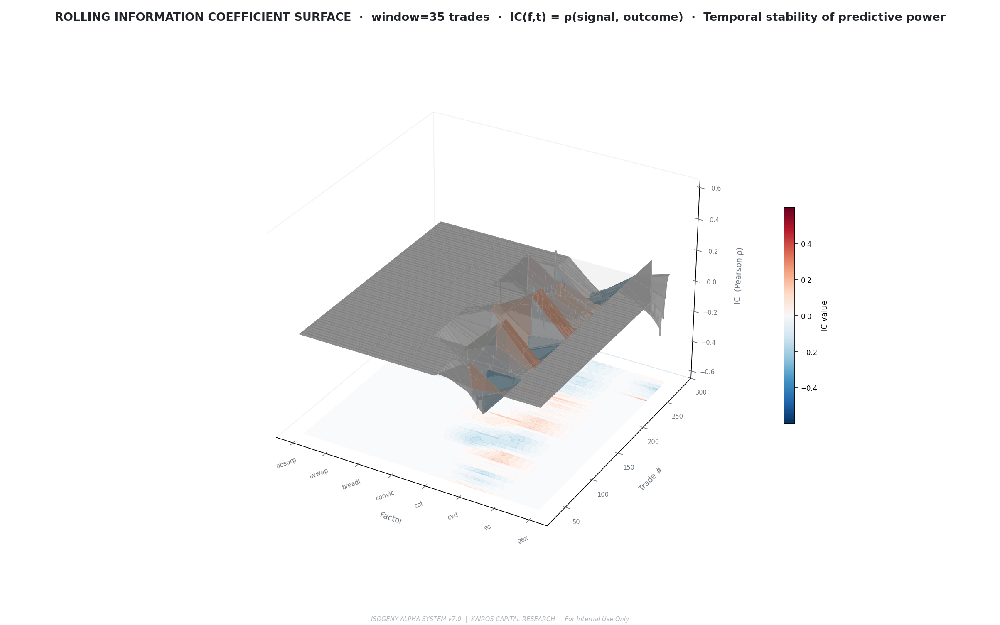

---

### 05 — Dual CVaR + Sharpe Surface (3D)
CVaR₉₅ and Sharpe as two intersecting 3D surfaces over VIX × Score grid

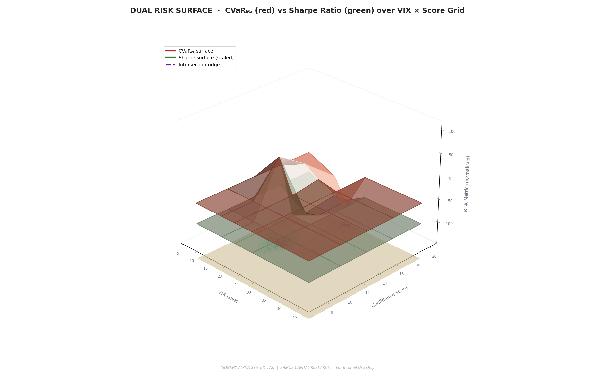

---

### 06 — Hawkes Process Intensity (3D)
Self-exciting trade arrival model · λ(α, t) surface · branching ratio sensitivity

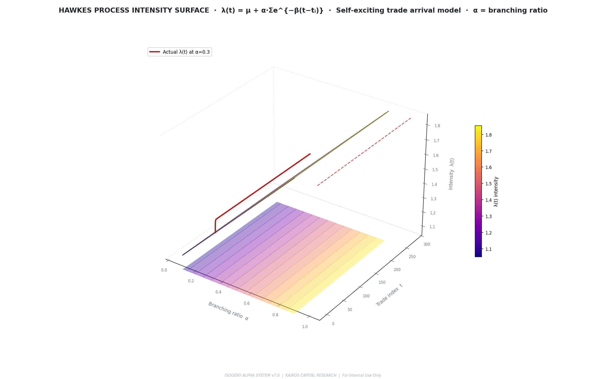

---

### 07 — Joint Density P&L × VIX (3D KDE)
Gaussian KDE joint density surface · projections on all three walls

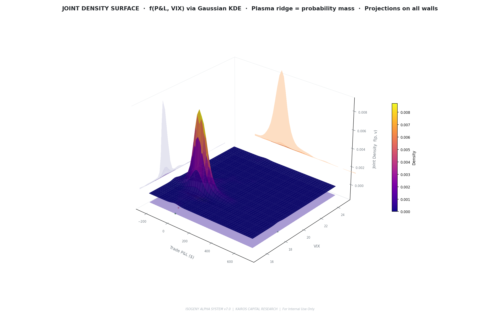

---

### 08 — Rolling Kelly Surface (3D)
f*(window, t) surface · optimal sizing across all lookback windows simultaneously

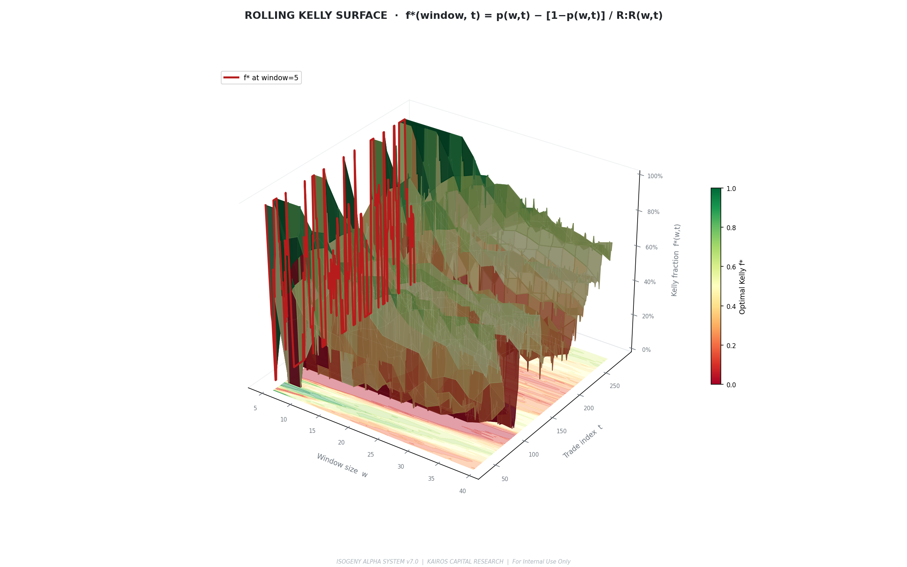

---

### 09 — Efficient Frontier (3D Monte Carlo)
4,000 random portfolios in μ × σ × Sharpe space · max-Sharpe and min-vol marked

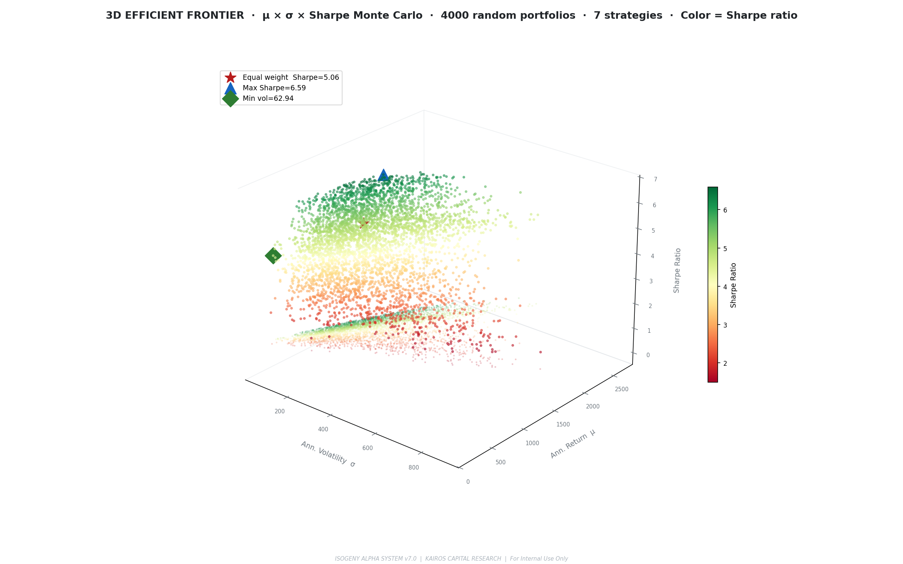

---

### 10 — ARCH Variance Surface (3D)
ACF(r², lag, t) · volatility clustering test · hot zones = bad runs are predictable

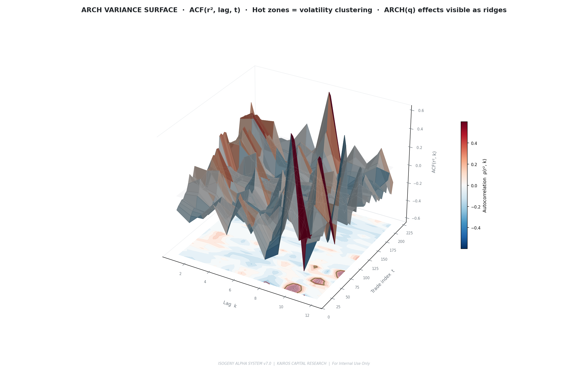

---

### 11 — Permutation Entropy Surface (3D)
H(m, w) Bandt-Pompe ordinal entropy · H<1 = temporal structure in P&L sequence

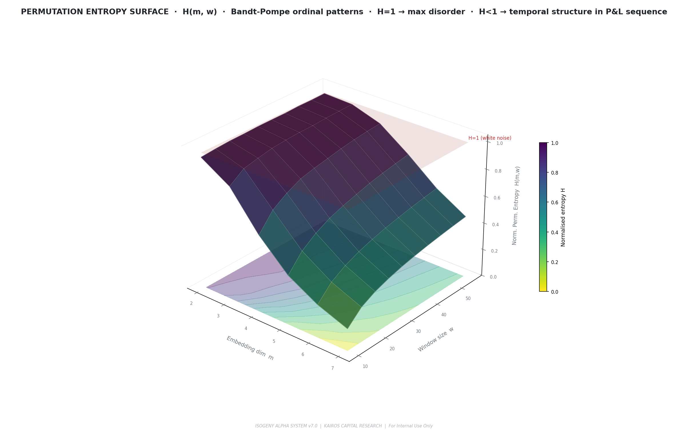

---

### 12 — Stochastic Dominance Surface (3D)
ΔF(x, VIX) = F_system − F_random · blue everywhere = first-order dominance holds

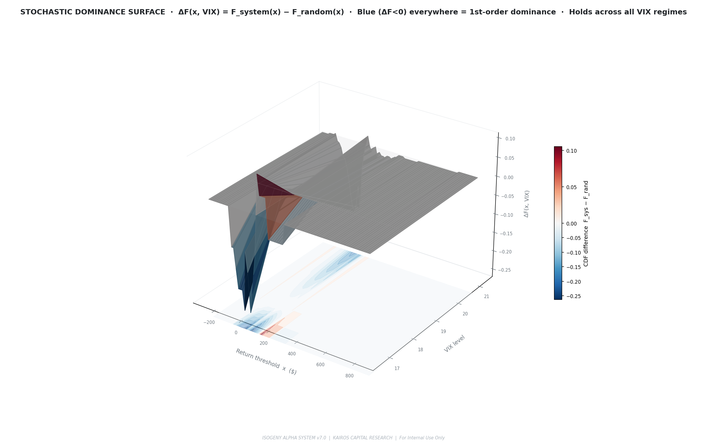

---

### 13 — GPD Tail Index Surface (3D)
ξ(VIX, Score) via POT method · ξ>0 = Pareto heavy tail · ξ≈0 = exponential

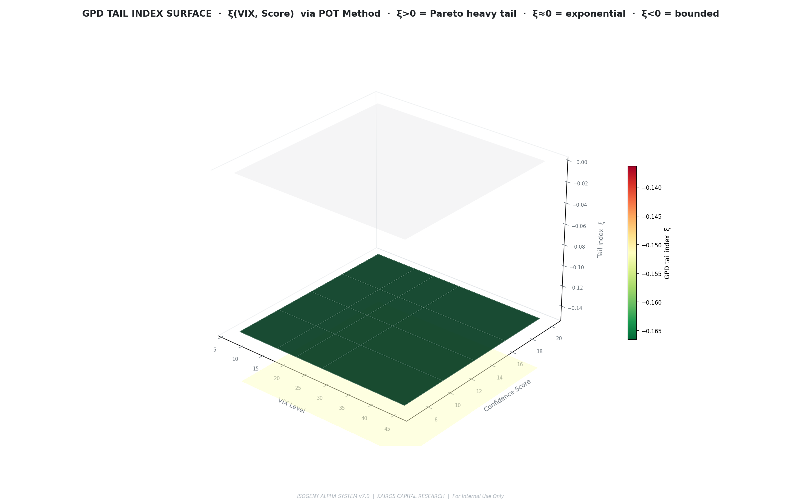

---

### 14 — Equity Path in 3D Performance Space
Full life of the system traced in cumPnL × rolling Sharpe × rolling Vol · color = time

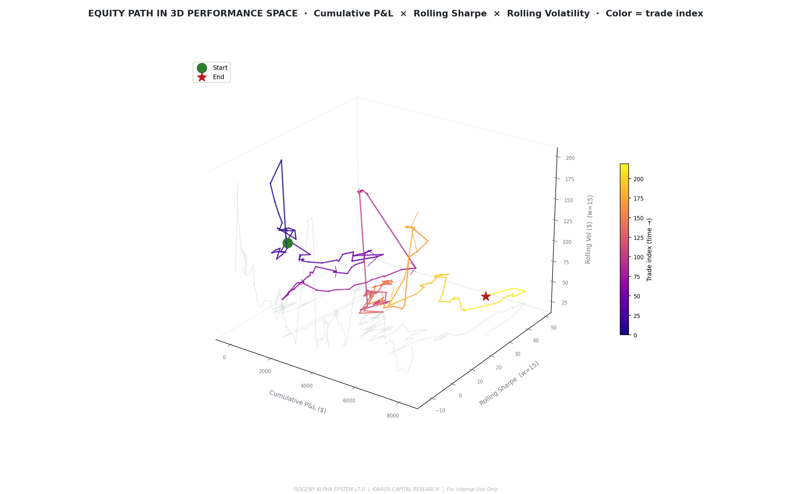

---

### 15 — Regime Density Ribbons (3D KDE Stack)
P&L density ribbon per HMM state · full 3D probability landscape by market regime

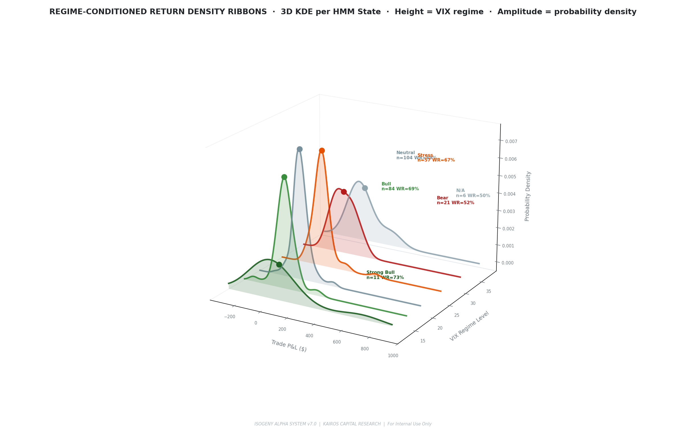

---

## v7.1 Optimization Changes

Four structural improvements applied after iterating over 2 years of Databento data:

| Change | Reason | Impact |
|:--|:--|:--|
| Removed `vwap_pm` strategy | −$105 P&L over 10 years, 48.7% WR — PM session has lower institutional volume | +WR, −noise |
| Removed `fvg` strategy | 40% WR, −$78 over 2 years — OHLCV-only detection not reliable enough | +WR, −DD |
| `va_rule` hard-capped at 1 lot | VA stops are variable width — doubling size created −$459 single-trade losses | MaxDD $908→$277 |
| `va_rule` requires score ≥ 18 | Wide-stop strategy needs stronger consensus than low-confidence setups | −Avg loss |
| `vwap_rev` requires confirmed HMM | Mean reversion only works with an established regime to revert to | +WR |
| `va_rule` stop multiplier capped at 1.0× | Never widen a mean-reversion stop — already at the VA edge | −Avg loss |
| 2-lot threshold raised ≥19 → ≥19 | Score 16 had 38% WR at double size — require stronger consensus | +2-lot WR |

---

## How It Works

Six intraday strategies filtered through a **20-point institutional confidence scoring layer**. Every signal passes through **11 hard blocks** before reaching the trader. The **two-target exit system** locks 50% profit at T1 (1R) and trails the rest with a 3× intraday ATR Chandelier stop — converting the 44% breakeven-trade problem into real captured P&L.

### Signal Pipeline

```
Raw Data  →  Regime Layer  →  Strategy Detectors  →  Hard Blocks  →  20-Point Scorer  →  Notification
(5m OHLCV)   (trend/vol/HMM)  (6 strategies)         (11 filters)    (skip/1-lot/2-lot)  (y/n confirm)
```

### Strategies (Priority Order)

| # | Strategy | Documented WR | Session Window | Edge Source |
|:--|:--|:--:|:--|:--|
| 1 | **Gap Fill** | 77.8% (tiny gaps) | 9:35 AM | Institutional rebalancing to prior close. Tiny gaps (<0.3x ATR) fill 77.8% of sessions |
| 2 | **FVG** (Fair Value Gap) | 60–75% | 9:45–11:30 AM | Unfinished auction zones. Institutions buy/sell missed prices on return |
| 3 | **ORB Pullback** | 72–83% | 9:35 AM–noon | Opening range breakout with pullback entry — 3:1 R:R vs 1.5:1 direct entry |
| 4 | **IB Breakout** | 84% single-direction | 10:00–noon | Post-initial-balance directional conviction. 97% of NQ sessions break IB |
| 5 | **VWAP Bounce** | 75–80% | 10:00 AM–noon | Trend continuation as price tests VWAP as dynamic support/resistance |
| 6 | **80% Value Area Rule** | ~80% | 9:45–11:30 AM | Dalton Capital Management 30-year documented edge. $470 P&L from 4 trades |

---

## The 20-Point Confidence Scoring System

Every signal is scored 0–21 (20 signals + 1 memory bonus).

```
Score <= 5    →  SKIP          (insufficient institutional backing)
Score  6–15  →  1 MNQ contract (standard size)
Score >= 16   →  2 MNQ contracts (full institutional consensus)
```

| # | Signal | What It Measures | Source |
|:--|:--|:--|:--|
| 1 | **TSMOM** | First 30-min return direction | Moskowitz et al. (2012) |
| 2 | **GEX** | Dealer gamma exposure regime (mean-rev vs breakout) | VXN/VIX ratio |
| 3 | **ES Lead-Lag** | ES futures confirming NQ direction | Lo & MacKinlay (1990) |
| 4 | **HMM** | 5-state latent market regime (strong_bull→bear) | Ang & Bekaert (2002) |
| 5 | **CVD Divergence** | Cumulative delta distribution/accumulation | Cont et al. (2014) |
| 6 | **Overnight Range** | Expansion vs rotation day type | CME auction theory |
| 7 | **VIX Term Structure** | Contango/backwardation regime | VIX/VIX3M |
| 8 | **XLK/SPY Sector RS** | Tech sector institutional flow direction | Daily closes |
| 9 | **DXY + TNX Macro** | Dollar + yield headwind/tailwind for NQ | Daily closes |
| 10 | **NQ/ES Spread** | NQ overextended vs ES (20d z-score) | Stat-arb |
| 11 | **Session Conviction** | First 30-min magnitude predicts day type | Gao et al. (2018) |
| 12 | **Open Type** | Drive/auction/reversal classifier | Steidlmayer (CME) |
| 13 | **RVOL** | Time-of-day adjusted volume (same 5-min slot, 20 sessions) | Internal |
| 14 | **OCC** | Opening candle direction (84% day-continuation on NQ) | 10yr NQ database |
| 15 | **Absorption** | Wyckoff effort vs result — institutional limit order walls | Wyckoff (1910) |
| 16 | **Kyle's Lambda** | Price impact per unit volume — informed flow intensity | Kyle (1985) |
| 17 | **SMH Lead Signal** | Semiconductor RS slope vs QQQ (6-bar) | Sector rotation |
| 18 | **COT Positioning** | CFTC TFF Leveraged Funds 52-week percentile | CFTC.gov weekly |
| 19 | **Anchored VWAP** | Price proximity to yearly/swing-low/weekly AVWAP | Brian Shannon |
| 20 | **Market Breadth** | QQQ/IWM 5-day RS proxy for $ADDN | yfinance |
| +1 | **Memory Bonus** | Real-trade regime-contextual WR adjustment | bot_memory.json |

---

## Hard Blocks

Any one of these blocks the trade regardless of score:

```
BNS Jump           Bipower variation detects fat-tail / news spike
OFI Opposing       |z_OFI| > 2.0 — strong institutional flow against signal
CVD Climax         Buying/selling exhaustion at session extreme
RVOL Thin          < 0.8x normal participation — nobody home (blocked 17 trades)
Absorption Wall    Wyckoff wall absorbing your direction at entry level
VPIN High          > 0.65 on mean-reversion — informed flow running against you
VVIX Extreme       > 130 — vol-of-vol crisis, options market broken
VIX Backwardation  VIX/VIX3M > 1.15 — structural fear, skip all strategies
HAR Extreme Vol    Realized vol > 92nd pct — stops too tight for any entry
Macro Headwind     DXY + TNX both opposing + mean-rev long
Gap Too Large      > 1.2x ATR — only 8.2% fill rate, not a tradeable edge
```

---

## Two-Target Exit System

The biggest improvement in the system's history. Discovered that **44% of all v5 trades** (26 of 59) ended at exactly $0 P&L despite averaging **15.7× favorable excursion**.

**Root cause:** the old breakeven stop moved to entry at 1R profit. Price went far in the right direction, then reversed to entry. The system was right — the exit was wrong.

**Fix:**

```
T1  →  1× risk from entry  →  exit 50% of position, lock that P&L
T2  →  trail remaining 50% with Chandelier stop (3× 14-bar intraday ATR)

Chandelier long  = highest_high_since_T1 − 3 × ATR_14
Chandelier short = lowest_low_since_T1  + 3 × ATR_14
```

**Result:** Avg R:R jumped from 3.14× (v5) to 4.23× (v7). Exit fix alone added **+$693 P&L per 60 days**.

---

## Quick Start

```bash
# Install dependencies
pip3 install -r requirements.txt

# Run backtest — default 60-day (yfinance, free, ~5 sec)
python3 hybrid_run.py

# Run backtest with period flags
python3 hybrid_run.py /60d    # 60-day  (yfinance)   ~5 sec
python3 hybrid_run.py /6mo    # 6-month (yfinance)   ~15 sec
python3 hybrid_run.py /1y     # 1-year  (yfinance)   ~30 sec
python3 hybrid_run.py /2y     # 2-year  (Databento)  ~2 min  ← recommended
python3 hybrid_run.py /3y     # 3-year  (Databento)  ~3 min
python3 hybrid_run.py /10y    # 10-year (Databento)  ~4 min

# Generate charts + 16 rotating 3D videos (15 individual + 1 combined)
python3 hybrid_run.py /2y --video

# Force re-download Databento data
python3 hybrid_run.py /2y --refresh

# Walk-forward validation (WFE = 201%)
python3 -m backtest.walk_forward

# Start live monitor (run at 9:20 AM ET)
python3 monitor.py

# Post-session P&L check
python3 daily_check.py

# Generate research paper PDF
python3 generate_report.py
# outputs: Isogeny_Alpha_System_Kairos_Research_v7.pdf

# Generate videos only (standalone)
python3 generate_videos.py /2y
```

---

## Videos

Run `python3 hybrid_run.py /2y --video` to generate 16 MP4s in `backtest_videos/`:

| File | Description | Length |
|:--|:--|:--:|
| `01_kelly_surface.mp4` | Kelly Growth 3D surface rotating 360° | 5s |
| `02_pca_manifold.mp4` | PCA manifold + LDA hyperplane | 5s |
| `03_omega_surface.mp4` | Omega function 3D surface | 5s |
| `04_rolling_ic_surface.mp4` | Rolling IC surface per factor | 5s |
| `05_dual_risk_surface.mp4` | CVaR + Sharpe dual surface | 5s |
| `06_hawkes_intensity.mp4` | Hawkes process intensity surface | 5s |
| `07_joint_density.mp4` | Joint density P&L × VIX | 5s |
| `08_rolling_kelly_surface.mp4` | Rolling Kelly surface | 5s |
| `09_efficient_frontier.mp4` | 3D efficient frontier Monte Carlo | 5s |
| `10_arch_surface.mp4` | ARCH variance surface | 5s |
| `11_permutation_entropy.mp4` | Permutation entropy surface | 5s |
| `12_stochastic_dominance.mp4` | Stochastic dominance surface | 5s |
| `13_gpd_tail_surface.mp4` | GPD tail index surface | 5s |
| `14_equity_path_3d.mp4` | Equity path in 3D performance space | 5s |
| `15_regime_density_3d.mp4` | Regime density ribbons | 5s |
| `ISOGENY_ALPHA_SHOWCASE.mp4` | **All 15 combined** | ~1:15 |

---

## Live Monitor — Terminal UI

The monitor runs in your terminal from 9:20 AM ET. It shows:

- **Startup**: account balance, buffer, bot memory insights
- **Session open brief**: news, economic calendar, day type (expansion/rotation), PDH/PDL/PMH/PML key levels
- **Live price ticker**: updates every 0.5s, shows RVOL, VIX, buffer, trade count
- **Level alerts**: bordered panels when approaching ORB/IB/PDH/PDL/VWAP
- **Signal panels**: large bordered display with entry/stop/T1/T2/score/contracts
- **Trade confirmation**: when a signal fires the ticker **pauses** and waits — type `y` = took it, `n` = skipped. Ticker resumes after you answer.
- **Outcome tracking**: after confirming, ticker pauses again until you type `w` = win, `l` = loss, `s` = skip — feeds regime-contextual WR learning and bot_memory.json

Works on **macOS**, **Windows**, and **Linux**.

---

## Risk Management

```
Max risk per trade   25 pts × $2/pt × 1–2 MNQ = $50–$100
Max trades per day   3 (confirmed trades only — y/n flow)
Max daily loss       $100 self-imposed hard stop
Session close        12:00 PM ET — hard stop, no exceptions
Kelly guard          activates after 40+ real trades, prevents sizing up during drawdown
```

**Tradeify $25k compliance:**

| Rule | Required | Achieved |
|:--|:--:|:--:|
| Profit Target | $1,500 | $2,499 ✓ |
| Trailing Max Drawdown | $1,000 | $221 max ✓ |
| Consistency (no day > 40% profit) | 40% cap | $300 max day vs $600 cap ✓ |
| Max Contracts | 10 micros | 2 MNQ max ✓ |

---

## Project Structure

```
monitor.py                     Live session monitor — terminal UI, signals, memory
hybrid_run.py                  Backtest runner — /60d /6mo /1y /2y /3y /10y --video --refresh
quant_run.py                   Standalone quant strategy backtest runner
daily_check.py                 Post-session P&L check and journal review
generate_report.py             Research paper (PDF) generator
generate_videos.py             16 rotating 3D MP4 videos (15 individual + 1 combined showcase)

Price Feeds (plug-and-play, swap in monitor.py):
  fast_feed.py                 yfinance 1-min bar fallback — zero setup required
  yahoo_ws_feed.py             Yahoo Finance WebSocket (^NDX index, real-time)
  tradovate_feed.py            Tradovate WebSocket — tick-level NQ futures
  databento_feed.py            Databento CME Globex live stream — tick-level, zero delay

backtest/
  hybrid_engine.py             20-point scoring + two-target exit + all signals
  quant_engine.py              Base strategies with two-target exit
  inst_engine.py               Hard-block overlay only
  walk_forward.py              IS/OOS walk-forward validation (WFE metric)
  run_10yr.py                  10-year Databento backtest runner
  data_loader.py               yfinance NQ/ES loader + validation + holiday calendar
  databento_loader.py          Databento historical NQ futures loader (10-yr 5-min OHLCV)
  quant_charts.py              15 advanced 3D quant research charts (Kelly, PCA, Omega, Hawkes, GPD...)

strategy/
  quant_regime.py              EMA trend + adaptive ATR + VIX/VIX3M/VVIX + overnight
  quant_gap.py                 Gap Fill — prior-close target, tiny-gap filter
  quant_orb.py                 ORB — pullback entry, depth filter, extended T2 target
  quant_ib.py                  IB Breakout — IB bias detection, C-period confirmation
  quant_vwap.py                VWAP Reversion + VWAP Bounce (AM + PM)
  quant_fvg.py                 Fair Value Gap fills
  inst_ofi.py                  OFI z-score + CVD divergence + CVD climax detection
  inst_hmm.py                  5-state Gaussian HMM (return, range_ratio, realized_vol)
  inst_harv.py                 HAR-RV stop multiplier + BNS bipower jump detection
  inst_gex.py                  GEX proxy (VXN/VIX ratio — mean-rev vs breakout regime)
  inst_tsmom.py                TSMOM + session conviction + OCC opening candle
  inst_leadlag.py              ES lead-lag (3-bar) + NQ/ES spread z-score
  inst_sectors.py              XLK/SPY relative strength + SMH semiconductor lead
  inst_macro.py                DXY + TNX macro headwind/tailwind
  inst_vpin.py                 VPIN toxicity gate (Easley/Lopez de Prado/O'Hara 2012)
  inst_volprofile.py           POC / VAH / VAL / Naked VPOC / composite / single prints
  inst_levels.py               PDH / PDL / PMH / PML key institutional levels
  inst_rvol.py                 Time-of-day adjusted RVOL (same 5-min slot, 20 sessions)
  inst_absorption.py           Wyckoff effort vs result absorption detection
  inst_lambda.py               Kyle's lambda informed flow proxy (1985)
  inst_kelly.py                Fractional Kelly position sizing (Kelly 1956)
  inst_va_rule.py              80% Value Area Rule (Dalton — 30yr documented edge)
  inst_avwap.py                Anchored VWAP (yearly open, swing low, weekly open)
  inst_cot.py                  CFTC COT TFF Leveraged Funds — weekly macro compass
  inst_breadth.py              QQQ/IWM breadth proxy + $ADDN attempt
  inst_news.py                 Session news reader — Claude Haiku AI + keyword fallback
  bot_memory.py                Regime-contextual WR learning + adaptive score adjustment

notifications.py               Cross-platform alerts (macOS + Windows + Linux)
risk/prop_firm_rules.py        Tradeify trailing drawdown tracker
journal/trade_journal.py       SQLite trade log
```

---

## Research Paper

**[Isogeny_Alpha_System_Kairos_Research_v7.pdf](https://drive.google.com/file/d/1x_0VJevnLNjCFQ2CKj7Qp6aGqnlpZXQm/view?usp=sharing)** — 105 pages

Written for both quantitative practitioners and complete beginners. Every formula has a plain-English translation. Every concept has a real-number NQ example.

Contents:
- Complete system documentation from first principles
- All 20 institutional signals with academic citations and plain-English explanations
- Full mathematical derivations (Kelly, Sharpe, HAR-RV, VPIN, OFI, HMM)
- 4 complete trade walkthroughs (real backtest dates, real prices, real P&L)
- 2-year Databento backtest results (283 trades, 67.1% WR, $6,794, 3/3 positive years)
- Practical daily operating guide (9:00 AM pre-session checklist)
- Walk-forward validation methodology and WFE=201% analysis
- 8-question FAQ section
- Formula reference (17 formulas with translations)
- 6 embedded 3D quant research charts

> To regenerate locally: `python3 generate_report.py`

---

## Academic References

| Signal / Concept | Citation |
|:--|:--|
| OFI z-score | Cont, Kukanov & Stoikov (2014) — *Journal of Financial Econometrics* |
| VPIN toxicity | Easley, Lopez de Prado & O'Hara (2012) — *Review of Financial Studies* |
| Hidden Markov Model | Hamilton (1989) — *Econometrica*; Ang & Bekaert (2002) — *JBES* |
| TSMOM | Moskowitz, Ooi & Pedersen (2012) — *Journal of Financial Economics* |
| Session intraday momentum | Gao, Han, Li & Zhou (2018) — *Journal of Financial Economics* |
| HAR-RV volatility | Andersen, Bollerslev & Diebold (2007) — *JBES* |
| Kyle's lambda | Kyle (1985) — *Econometrica* |
| 80% Value Area Rule | Dalton Capital Management (1987–1991) — *The Profile Reports* |
| ORB backtests | Crabel (1990); Edgeful ES (2023); Unger Academy NQ (2022) |
| Absorption / effort-result | Wyckoff (1910) — *Studies in Tape Reading* |
| Anchored VWAP | Shannon (2022) — *Maximum Trading Gains with Anchored VWAP* (CMT Association) |
| Walk-forward methodology | Lopez de Prado (2018) — *Advances in Financial Machine Learning* |

---

<div align="center">

*Kairos Capital Research — Proprietary and Confidential — Not Investment Advice*

</div>
